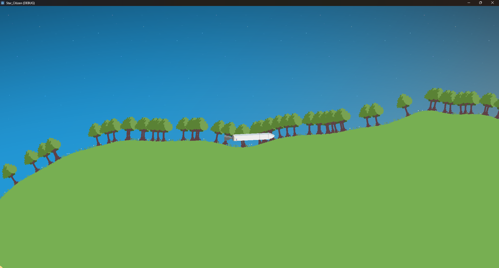
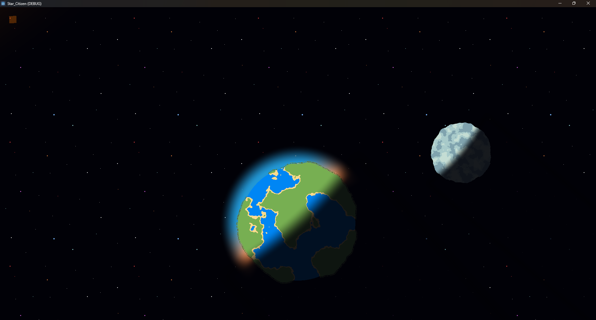
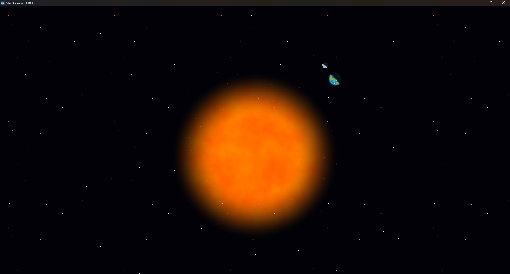

# Renard Space Program

Renard Space Program is a 2D space exploration game developed using the Godot Engine. The game features a procedurally generated universe with pixel-art planets, a dynamic solar system, and a simple rocket for interstellar travel. This project was created as a way to explore advanced techniques in procedural generation and shader development.

---

## Features

- **Procedurally Generated Planets:**
  - Each planet is generated using perlin noise, and rendered using custom shaders for a pixel-art style.

- **Dynamic Solar System:**
  - A sun at the center.
  - An Earth orbiting the sun, with grass, trees, an atmosphere and a shadow projecting onto other celestial bodies 
  - A moon orbiting Earth.

- **Rocket Gameplay:**
  - A simple rocket allows players to explore the cosmos and navigate planets.

---

## Screenshots

### On the Ground


### Planet View


### The Sun


### Earth shadow on the moon


---

## Getting Started

1. **Clone the Repository:**
   ```bash
   git clone https://github.com/MaitreRenard18/Renard-space-program
   ```

2. **Open in Godot:**
   - Launch Godot 4.
   - Open the project folder.

3. **Run the Game:**
   - Get to the "solar_system" scene and press the play button.
